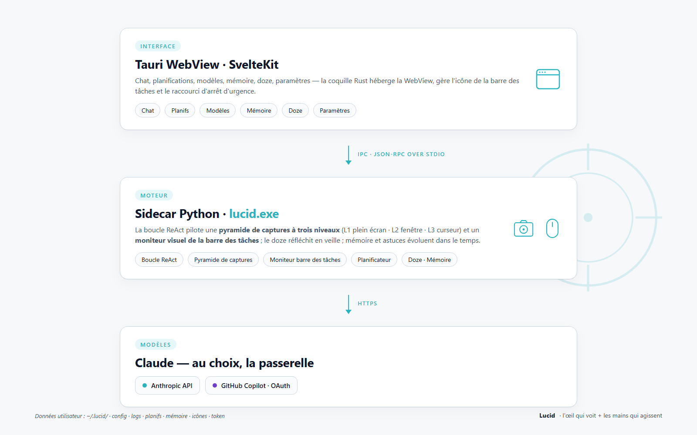

<p align="center">
  <ins><a href="README.md">English</a></ins> &nbsp;|&nbsp; <ins><a href="README.zh-CN.md">简体中文</a></ins> &nbsp;|&nbsp; Français
</p>

<p align="center">
  
</p>

> **Un regard limpide pour votre bureau Windows — un véritable agent visuel qui se sert de l'ordinateur comme un humain : sans MCP, contrôle direct de vos applications Windows, auto-réponse continue quand vous êtes absent.**
> Dites à Lucid ce que vous voulez faire. Il scrute l'écran, manipule la souris ; quand vous n'êtes pas là, il lit les messages entrants et répond poliment à votre place.

- **Sans MCP. Sans API par application. Sans plugin de navigateur.** Juste la **vision multimodale d'un grand modèle** qui pilote votre vrai clavier et votre vraie souris.
- **Sans UIA ni arbre d'accessibilité non plus.** Lucid envoie l'écran directement au modèle de vision et lit les coordonnées sur une grille superposée à l'image — WeChat, Electron, jeux, UI dessinées à la main (tout ce qu'UIA ne voit pas) sont pilotés de la même façon.
> **Contrairement aux bots officiels (WeChat, Slack, Teams) — Lucid contrôle votre vrai client**, donc il peut lire n'importe quel message, voir tout l'historique, répondre en votre nom, avec persistance d'état et sans enregistrement.

> **D'où vient le nom ?** *Lucid* — clair, perspicace, l'esprit transparent. Notre mascotte est un petit crabe : il avance de côté sans jamais quitter l'écran des yeux — exactement ce que fait l'agent.

> **Vidéo de démo** — auto-réponse de bout en bout : l'écouteur UIA de la barre des tâches capte le message entrant → `launch_app` ouvre Teams → des clics pilotés par la vision naviguent dans la conversation → l'agent tape la réponse et appuie sur Entrée. Sans MCP, sans API ; tout passe par le vrai client.

https://github.com/user-attachments/assets/4d2107b6-02d3-4726-a207-dcfb5db006de

```
Teams (entrant) :  « Tell me a joke about dog and cat »
          ↓
Lucid :  *l'écouteur UIA de la barre des tâches voit un nouveau message Teams (pas besoin de confirmation LLM)*
          → launch_app("Microsoft Teams")  → ouvre la conversation, lit la demande
          → invente une blague sur un chien et un chat
          → click(champ de saisie) → type("…texte de la blague…") → key("enter")
          → « Fait. Répondu dans Teams avec la blague. »
```

> **Plus de démos :** [Voir toutes les vidéos et scénarios](README.demos.md)

---

## Pourquoi Lucid ?

| | RPA traditionnel / bots liés à des API | **Lucid** |
| --- | --- | --- |
| Intégration par appli | Chaque appli demande un SDK / plugin / serveur MCP | **Zéro.** Si un humain peut l'utiliser, Lucid le peut aussi. |
| Marche avec les applis fermées (banques, ERP, jeux, WeChat…) | ❌ rarement | ✅ les pixels restent des pixels |
| Auto-réponse aux messages | Bots officiels seulement ; approbation requise ; pas d'état ; ne voit pas l'historique complet | ✅ **Contrôle votre vrai client.** Lit n'importe quel message, voit l'historique complet, répond en votre nom, avec persistance d'état. |
| Mise en place | Des heures de glue code | Installer, choisir un LLM, taper une phrase |
| Casse à chaque mise à jour d'API | En permanence | Seulement si l'UI change visuellement |
| Coût | Verrouillage fournisseur | Apportez votre propre LLM (Anthropic / GitHub Copilot / OpenAI / Gemini) |
| Diversité & inclusion | Rarement pris en compte | ✅ **Maintenez la barre d'espace pour parler ; la parole est transcrite et exécutée directement** — Lucid devient utilisable pour les personnes à mobilité réduite (ou pour quiconque préfère la voix au clavier). |

---

## Architecture, en bref



> **Pour aller plus loin :** [Aperçu technique de Lucid](https://daozhang0123.github.io/Lucid/lucid.html) — architecture, pyramide de captures, moniteur de barre des tâches, apprentissage Doze, skills, voix.

Données utilisateur : `~/.lucid/` (config, logs, planifs, mémoire, cache d'icônes, jeton Copilot).

---

## Installation (utilisateurs finaux)

Téléchargez `lucid_<version>_x64-setup.exe` depuis une release, lancez l'installateur, démarrez **Lucid** depuis le menu Démarrer.

Au premier lancement, ouvrez **Paramètres** et choisissez un backend LLM :

- **GitHub Copilot** — cliquez sur *Sign in to GitHub Copilot* et suivez le flux device-code. Gratuit tant que vous avez un abonnement Copilot. Modèle par défaut `claude-opus-4.6` ; la liste des modèles est récupérée automatiquement via l'endpoint `/models` de Copilot, donc tout modèle débloqué par votre abonnement (Claude Opus 4.x, GPT-5.x, Gemini 2.x, …) apparaît tout seul.
- **Anthropic** — collez une clé `sk-ant-…`.
- **OpenAI** — collez une clé `sk-…` (les base URL compatibles OpenAI sont également supportées, ex. Azure / passerelles proxy).
- **Gemini** — collez une clé d'API Google AI Studio.

---

## Compiler depuis les sources

### Prérequis
- Windows 10 / 11
- Python 3.11+ (testé sur 3.14)
- Node.js 20+ et npm
- Toolchain Rust (stable) + **WebView2 Runtime** (préinstallé sur Win11)

### 1) Sidecar Python

```powershell
cd D:\Project\Lucid
python -m venv .venv
.\.venv\Scripts\Activate.ps1
pip install -e .

pip install pyinstaller
pyinstaller packaging\lucid.spec
# → dist\lucid.exe
```

### 2) Application Tauri

```powershell
cd app
npm install
npm run tauri build
# → app\src-tauri\target\release\bundle\nsis\lucid_<ver>_x64-setup.exe
```

---

## Utilisation en CLI (sans GUI)

Lancez les commandes depuis la racine du dépôt (`D:\Project\Lucid`).

Si votre provider demande une clé, définissez-la d'abord :

```powershell
# provider anthropic
$env:ANTHROPIC_API_KEY = "sk-ant-..."
```

(Pour GitHub Copilot, faites le flow device-code depuis **Paramètres** dans l'UI — aucune variable d'environnement nécessaire.)

Puis exécutez :

```powershell
cd D:\Project\Lucid

# Test de connectivité (un seul tour, ne touche pas la souris/clavier)
.venv\Scripts\python.exe -m lucid --smoke-test "Qui es-tu ? Une phrase."

# Lancer une tâche
.venv\Scripts\python.exe -m lucid `
    "Prends une capture plein écran et dis-moi combien de fenêtres sont visibles."

# Changer de modèle
.venv\Scripts\python.exe -m lucid --model claude-sonnet-4.5 "Ouvre Notepad et tape hello"

# À réserver à une VM / bureau jetable pour les actions destructrices
..\.venv\Scripts\python.exe -m lucid "Ouvre Notepad, tape hello world, enregistre sur le Bureau"
```

Si vous voyez `missing api_key`, renseignez `[llm.anthropic].api_key` dans `~/.lucid/config.toml`, exportez `ANTHROPIC_API_KEY`, ou basculez sur le provider Copilot depuis **Paramètres**.

`Ctrl+C` pour interrompre. Lancer la souris dans le **coin haut-gauche** déclenche le fail-safe de PyAutoGUI.

---

## Configuration

Modèle par défaut : [config.toml](config.toml). La **vraie** config utilisateur est à `~/.lucid/config.toml` — c'est celle-là qu'il faut éditer (le fichier livré est écrasé à la mise à jour).

Sections clés :

| Section | Ce qu'elle contrôle |
| --- | --- |
| `[llm]` | provider, max_tokens, prompt-cache, temperature/top-p, rétention des captures |
| `[llm.anthropic]` / `[llm.copilot]` | model + endpoint + clé par provider |
| `[logging]` | dossier de log par exécution, niveaux texte/image (`DEBUG/INFO/WARNING/ERROR/OFF`), `png/jpg`, rotation |
| `[screenshot]` | intervalles des trois niveaux, redimensionnement, rétention par niveau, seuil de détection de changement |
| `[safety]` | raccourci d'arrêt d'urgence (`ctrl+alt+esc`), vérif de clic, garde dialogues |
| `[input]` | `chinese_input = "clipboard"` (recommandé) ou `unicode_sendinput`, délai entre actions |
| `[visual_notify]` | fréquence de polling, seuil dHash, cooldown LLM, instruction auto-chat |
| `[taskbar_uia]` | écouteur barre des tâches événementiel, zéro LLM (diffs Name / HelpText du sous-arbre Shell_TrayWnd) ; tourne en parallèle de `[visual_notify]` et supprime son step-2 quand il déclenche en premier |
| `[doze]` | limites de la réflexion en veille |
| `[voice]` | raccourci push-to-talk (par défaut barre d'espace maintenue), moteur Whisper + taille de modèle, envoi automatique |
| `[memory]` / `[tools]` | mémoire long terme + astuces : on/off et limites |
| `[fileio]` / `[shell]` | activation / sandbox des `read_file` / `write_file` / `run_shell` |
| `[skills]` | répertoire des skills + injection de la liste « ## Available skills » dans le system prompt |
| `[ui]` | langue de l'UI (`en` / `zh-CN` / `fr-FR`), thème, préférences de hot-reload |

Sauvegarder dans Paramètres recharge le sidecar à chaud.

---

## Avertissement

- Le modèle **prend complètement le contrôle de votre souris et de votre clavier**. À utiliser sur un bureau que vous pouvez interrompre, ou en VM.
- Les captures sont envoyées au backend LLM choisi (Anthropic / GitHub Copilot upstream).
  **Fermez ou minimisez les fenêtres sensibles (mots de passe, banque, messages privés) avant de lancer une tâche.**
- L'auto-réponse de la barre des tâches embarque une politique de sécurité codée en dur côté system prompt (pas de divulgation de codes / adresses, pas de clic sur payer / accepter, escalade-et-arrêt en cas de doute), mais vérifiez quand même quelles applis vous mettez en liste blanche.

---

## Stargazers

[](https://github.com/DaoZhang0123/Lucid/stargazers)
