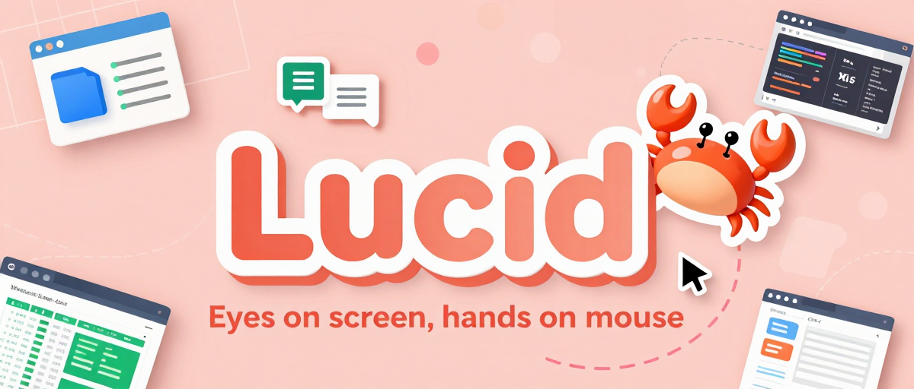
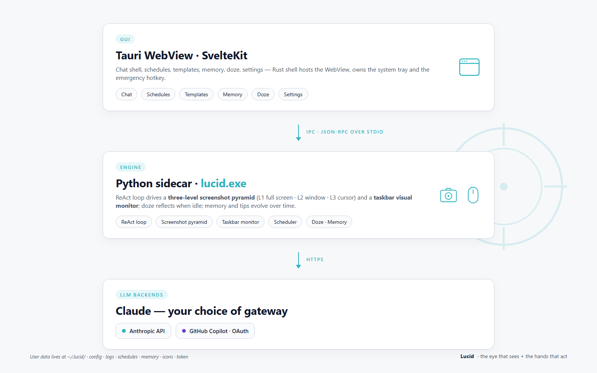

<p align="center">
  English &nbsp;|&nbsp; <ins><a href="README.zh-CN.md">简体中文</a></ins> &nbsp;|&nbsp; <ins><a href="README.fr-FR.md">Français</a></ins>
</p>

<p align="center">
  
</p>

> **A clear-eyed assistant for your Windows desktop — a true "human-like computer-use" vision agent: no MCP, direct control of your Windows apps, continuous auto-reply while you're away.**
> Tell Lucid what you want done. It scopes out the screen, works the mouse, reads incoming messages while you're away, and quietly replies on your behalf.

- **No MCP. No per-app APIs. No browser plugins.** Just a **vision-capable LLM** driving your real keyboard and mouse.
- **No UIA, no accessibility tree either.** Lucid feeds the screen straight to the vision model and reads coordinates off a grid overlay on the image — so WeChat, Electron, games, custom-drawn UIs (anything UIA can't see) all work the same way.
- **Unlike official bots (WeChat, etc.), Lucid controls your actual client** — so it can read any message, see any context, and reply as you, with full state persistence and no registration overhead.

> **Why "Lucid"?** *Lucid* — clear, perceptive, transparent of mind. Our mascot is a little crab: walking sideways while keeping both eyes wide open on the screen — exactly what the agent does.

> **Demo video** — end-to-end auto-reply: taskbar UIA listener picks up the incoming message → `launch_app` opens Teams → vision-driven clicks navigate the chat → the agent types the reply and hits Enter. No MCP, no API; everything runs through the real client.

https://github.com/user-attachments/assets/4d2107b6-02d3-4726-a207-dcfb5db006de

```
Teams (incoming):  "Tell me a joke about dog and cat"
          ↓
Lucid:   *taskbar UIA listener sees a new Teams message (no LLM confirm needed)*
          → launch_app("Microsoft Teams")  → open the chat, read the request
          → think up a joke about a dog and a cat
          → click(chat input) → type("…joke text…") → key("enter")
          → "Done. Replied in Teams with the joke."
```

> **More demos:** [See all demo videos and scenarios](README.demos.md)

---

## Why Lucid?

| | Traditional RPA / API-bound bots | **Lucid** |
| --- | --- | --- |
| Per-app integration | Each app needs an SDK / plugin / MCP server | **Zero.** If a human can use it, Lucid can use it. |
| Works with closed apps (banks, ERP, games, WeChat…) | ❌ usually not | ✅ pixels are pixels |
| Auto-reply to messages | Official bots only; registration required; can't persist state; can't see full context | ✅ **Controls your real client.** Reads any message, sees full history, replies as you, stateful. |
| Setup | Hours of glue code | Install, pick an LLM, type a sentence |
| Fails when an app updates its API | Constantly | Only if the UI changes visually |
| Cost | Vendor lock-in | Bring-your-own LLM (Anthropic / GitHub Copilot / OpenAI / Gemini) |
| Diversity & inclusion | Rarely considered | ✅ **Hold the spacebar to speak; speech is transcribed and run directly** — makes Lucid usable for people with limited mobility (or anyone who prefers voice over typing). |

---

## Architecture, briefly



> **Deep dive:** [Lucid technical overview](https://daozhang0123.github.io/Lucid/lucid.html) — architecture, screenshot pyramid, taskbar monitor, doze learning, skills, voice.

User data: `~/.lucid/` (config, logs, schedules, memory, icons cache, Copilot token).

---

## Install (end users)

Download `lucid_<version>_x64-setup.exe` from a release, run it, launch **Lucid** from the Start menu.

On first run, open **Settings** and pick an LLM provider:

- **GitHub Copilot** — click *Sign in to GitHub Copilot*, do the device-code flow. Free as long as you have a Copilot subscription. Default model `claude-opus-4.6`; the model dropdown is auto-populated from Copilot's `/models` endpoint, so any model your subscription unlocks (Claude Opus 4.x, GPT-5.x, Gemini 2.x, …) shows up automatically.
- **Anthropic** — paste an `sk-ant-…` key.
- **OpenAI** — paste an `sk-…` key (OpenAI-compatible base URLs are also supported, e.g. Azure / proxy gateways).
- **Gemini** — paste a Google AI Studio API key.

---

## Build from source

### Prerequisites
- Windows 10 / 11
- Python 3.11+ (verified on 3.14)
- Node.js 20+ and npm
- Rust toolchain (stable) + the **WebView2 Runtime** (preinstalled on Win11)

### 1) Python sidecar

```powershell
cd D:\Project\Lucid
python -m venv .venv
.\.venv\Scripts\Activate.ps1
pip install -e .

pip install pyinstaller
pyinstaller packaging\lucid.spec
# → dist\lucid.exe
```

### 2) Tauri app

```powershell
cd app
npm install
npm run tauri build
# → app\src-tauri\target\release\bundle\nsis\lucid_<ver>_x64-setup.exe
```

---

## CLI usage (no GUI)

Run from the repo root (`D:\Project\Lucid`).

If your provider needs a key, set it first:

```powershell
# anthropic provider
$env:ANTHROPIC_API_KEY = "sk-ant-..."
```

(For GitHub Copilot, run the device-code flow from Settings in the GUI — no env var needed.)

Then run:

```powershell
cd D:\Project\Lucid

# Connectivity smoke test (single round, no mouse/keyboard)
.venv\Scripts\python.exe -m lucid --smoke-test "Who are you? One sentence."

# Run a task
.venv\Scripts\python.exe -m lucid `
    "Take a fullscreen screenshot and tell me how many windows are visible."

# Switch model
.venv\Scripts\python.exe -m lucid --model claude-sonnet-4.5 "Open Notepad and type hello"

# Run on a sandbox / VM only when you trust the instruction
.venv\Scripts\python.exe -m lucid "Open Notepad, type hello world, save to Desktop"
```

If you see `missing api_key`, set `[llm.anthropic].api_key` in `~/.lucid/config.toml` or export `ANTHROPIC_API_KEY` — or switch to the Copilot provider in **Settings**.

`Ctrl+C` to abort. Slamming the mouse to the **top-left corner** triggers PyAutoGUI's fail-safe.

---

## Configuration

Default template: [config.toml](config.toml). The **real** user config is at `~/.lucid/config.toml` — edit that one (the bundled file is overwritten on upgrade).

Key sections:

| Section | What it controls |
| --- | --- |
| `[llm]` | provider, max tokens, prompt-cache, temperature/top-p, screenshot retention |
| `[llm.anthropic]` / `[llm.copilot]` | per-provider model + endpoint + key |
| `[logging]` | per-run log dir, text/image levels (`DEBUG/INFO/WARNING/ERROR/OFF`), `png`/`jpg`, retention |
| `[screenshot]` | three-pyramid intervals, downscale long edges, per-level retention, change-detection threshold |
| `[safety]` | emergency hotkey (`ctrl+alt+esc`), click verification, save-dialog guard |
| `[input]` | `chinese_input = "clipboard"` (recommended) or `unicode_sendinput`, action delay |
| `[visual_notify]` | taskbar polling, dHash threshold, LLM confirmation cadence, auto-chat instruction |
| `[taskbar_uia]` | event-driven, zero-LLM taskbar listener (Shell_TrayWnd Name/HelpText diffs); runs in parallel with `[visual_notify]` and suppresses its step-2 when it hits first |
| `[doze]` | idle-time reflection limits |
| `[voice]` | push-to-talk hotkey (hold-spacebar by default), Whisper engine + model size, auto-send |
| `[memory]` / `[tools]` | long-term memory + operation tips on/off and limits |
| `[fileio]` / `[shell]` | enable / sandbox `read_file` / `write_file` / `run_shell` |
| `[skills]` | skills directory + injection of `## Available skills` into the system prompt |
| `[ui]` | UI locale (`en` / `zh-CN` / `fr-FR`), theme, hot-reload preferences |

GUI Settings hot-reloads the sidecar after saving.

---

## Risk reminder

- The model **takes over your real mouse and keyboard**. Run it on a desktop you can afford to interrupt, or in a VM.
- Screenshots are uploaded to whichever LLM backend you choose (Anthropic / GitHub Copilot upstream).
  **Close or minimise sensitive windows (password fields, banking, private chats) before running tasks.**
- Visual taskbar auto-reply has a hard-coded safety policy at the system-prompt layer (no leaking codes / addresses, no clicking pay / agree, escalate-and-stop on ambiguity), but you should still review which apps you whitelist.

---

## Stargazers

[](https://github.com/DaoZhang0123/Lucid/stargazers)
