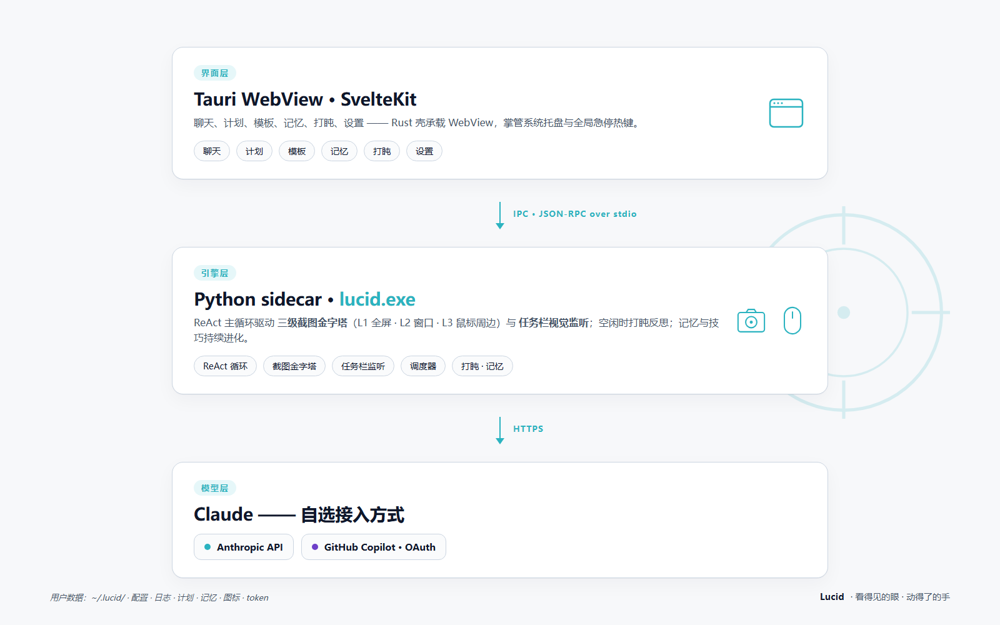

<p align="center">
  <ins><a href="README.md">English</a></ins> &nbsp;|&nbsp; 简体中文 &nbsp;|&nbsp; <ins><a href="README.fr-FR.md">Français</a></ins>
</p>

<p align="center">
  
</p>

> **为你的 Windows 桌面配上一双澄澈、不眨的眼睛——一个真正“像人操作电脑”的 Windows 视觉智能体：无需 MCP，直接控制你的应用，你不在时持续自动回复。**
> 把要做的事说给 Lucid，它会看屏幕、动鼠键；你不在的时候，它替你看消息、替你回话。

- **不依赖任何 MCP / 应用 API / 浏览器插件。** 仅靠**多模态大模型的视觉能力**指挥真实的鼠标和键盘。
- **也不依赖 UIA / 控件树。** 全靠截图传给视觉模型，模型在带坐标网格的图上直接读 `(x, y)` 点击 —— 微信 / Electron / 游戏 / 自绘 UI 这些 UIA 看不到的应用，同一套方案直接能用。
- **不同于官方 bot（微信等）——Lucid 直接控制你的真实客户端，**所以能看任何消息、读到完整上下文、以你的身份回话，还有状态持久化、无需审核。

> **名字从哪来？** **明眸**——出自“明眸善睞”，明亮、洞察、看得清。吉祥物是一只小螃蟹：横着走路，也始终睁大眼睛盯着屏幕——这正是 Lucid 干的事。

> **演示视频** — 完整的 auto-reply 过程：任务栏 UIA 监听捕获新消息 → `launch_app` 拉起聊天客户端 → 视觉驱动点击定位到对话 → agent 输入回复并回车发送。全程不走 MCP、不调 API，全部走你真实的客户端。

https://github.com/user-attachments/assets/d03d2f55-5d11-43da-8809-3f5de63dd5c4

```
微信（新消息）：  “宝宝，给我讲一个笑话吧，关于这个程序员买西瓜和苹果的”
          ↓
Lucid：  *任务栏 UIA 监听看到微信新消息（不需要 LLM 二次确认）*
          → launch_app("微信")  → 打开对话，读取请求
          → 想一个程序员买西瓜和苹果的笑话
          → click(输入框) → type("…笑话内容…") → key("enter")
          → “完成。已在微信回复笑话。”
```

> **更多演示：** [查看完整 Demo 视频与场景](README.demos.md)

---

## 为什么是 Lucid

| | 传统 RPA / 走 API 的 bot | **Lucid** |
| --- | --- | --- |
| 适配每个 App | 每个都要 SDK / 插件 / MCP server | **零适配。** 人能用，它就能用。 |
| 闭源/老旧软件（网银、ERP、游戏、微信…） | ❌ 通常不行 | ✅ 像素就是像素 |
| 给你自动回复消息 | 官方 bot 只能；需要审核；无状态；看不到完整历史 | ✅ **驱动你真实的客户端。** 能看任何消息、读完整历史、以你的身份回话、有状态持久化。 |
| 上手成本 | 几小时胶水代码 | 装好 → 选 LLM → 一句话 |
| App 一更新 API 就崩 | 经常 | 只在 UI 视觉变了之后崩 |
| 成本 | 厂商锁定 | 自己挑 LLM（Anthropic / GitHub Copilot / OpenAI / Gemini） |
| 多元与无障碍（D&I） | 几乎不考虑 | ✅ **长按空格键语音转文字后直接执行**，方便行动不便但能说话的残障人士及任何偏好语音交互的用户 |

---

## 架构（一图）



> **深入了解：** [Lucid 技术总览](https://daozhang0123.github.io/Lucid/lucid.html) —— 架构、截图金字塔、任务栏监听、打盹学习、技能、语音。

用户数据：`~/.lucid/`（配置、日志、计划、记忆、图标缓存、Copilot token）。

---

## 安装（终端用户）

去 release 下载 `lucid_<版本>_x64-setup.exe`，跑安装包，从开始菜单启动 **Lucid**。

首次启动后进**设置**，挑一个 LLM 后端：

- **GitHub Copilot** —— 点 *Sign in to GitHub Copilot*，按提示走设备码流程。只要订阅了 Copilot 就能用。默认模型 `claude-opus-4.6`；模型下拉列表会自动从 Copilot 的 `/models` 接口拉取，订阅里能用的所有模型（Claude Opus 4.x、GPT-5.x、Gemini 2.x …）都会自动出现。
- **Anthropic** —— 粘 `sk-ant-…` 密钥。
- **OpenAI** —— 粘 `sk-…` 密钥（同时支持任何 OpenAI 兼容的 base URL，比如 Azure / 第三方代理网关）。
- **Gemini** —— 粘 Google AI Studio 的 API key。

---

## 从源码构建

### 前置
- Windows 10 / 11
- Python 3.11+（验证过 3.14）
- Node.js 20+ 和 npm
- Rust 工具链（stable）+ **WebView2 运行时**（Win11 自带）

### 1）Python sidecar

```powershell
cd D:\Project\Lucid
python -m venv .venv
.\.venv\Scripts\Activate.ps1
pip install -e .

pip install pyinstaller
pyinstaller packaging\lucid.spec
# → dist\lucid.exe
```

### 2）Tauri 应用

```powershell
cd app
npm install
npm run tauri build
# → app\src-tauri\target\release\bundle\nsis\lucid_<版本>_x64-setup.exe
```

---

## CLI 用法（不带 GUI）

请在仓库根目录（`D:\Project\Lucid`）运行。

如果当前 provider 需要 key，请先设置：

```powershell
# anthropic provider
$env:ANTHROPIC_API_KEY = "sk-ant-..."
```

（GitHub Copilot 在 GUI 的「设置」里走 device-code 登录即可，不用环境变量。）

然后执行：

```powershell
cd D:\Project\Lucid

# 连通性烟雾测试（单轮，不动鼠键）
.venv\Scripts\python.exe -m lucid --smoke-test "你是谁？一句话。"

# 跑一个任务
.venv\Scripts\python.exe -m lucid `
    "截一张全屏图，告诉我屏幕上有几个明显的窗口"

# 换模型
.venv\Scripts\python.exe -m lucid --model claude-sonnet-4.5 "打开记事本，输入 hello"

# 只在虚拟机 / 干净桌面里跑这种可能影响现有文件的任务
.venv\Scripts\python.exe -m lucid "打开记事本，输入 hello world，保存到桌面"
```

如果出现 `missing api_key`，请在 `~/.lucid/config.toml` 里设置 `[llm.anthropic].api_key`、导出 `ANTHROPIC_API_KEY` 环境变量，或者在「设置」里改用 Copilot provider。

`Ctrl+C` 中断；把鼠标快速甩到屏幕**左上角**会触发 PyAutoGUI 的 fail-safe。

---

## 配置

默认模板在仓库根 [config.toml](config.toml)。**真正生效**的用户配置在 `~/.lucid/config.toml`，要改就改这个（仓里那份升级会被覆盖）。

主要段落：

| 段 | 控什么 |
| --- | --- |
| `[llm]` | provider、max_tokens、prompt-cache、temperature/top-p、截图保留策略 |
| `[llm.anthropic]` / `[llm.copilot]` | 各 provider 的 model + 端点 + key |
| `[logging]` | 每次运行日志根目录、文本/图片等级（`DEBUG/INFO/WARNING/ERROR/OFF`）、`png/jpg`、轮转 |
| `[screenshot]` | 三级金字塔的频率、长边上限、每级保留张数、变化检测阈值 |
| `[safety]` | 急停热键（`ctrl+alt+esc`）、落点取证、保存对话框防护 |
| `[input]` | `chinese_input = "clipboard"`（推荐）或 `unicode_sendinput`，动作间隔 |
| `[visual_notify]` | 任务栏轮询频率、dHash 阈值、LLM 二次确认冷却、auto-chat 指令 |
| `[taskbar_uia]` | 事件驱动、零 LLM 开销的任务栏监听通道（监 Shell_TrayWnd 子树 Name / HelpText 变化），与 `[visual_notify]` 并行；命中后会抑制视觉通道的 step-2 LLM 调用 |
| `[doze]` | 打盹反思的各种上限 |
| `[voice]` | 语音热键（默认长按空格）、Whisper 引擎 + 模型大小、是否自动发送 |
| `[memory]` / `[tools]` | 长期记忆 + 操作技巧的开关与上限 |
| `[fileio]` / `[shell]` | `read_file` / `write_file` / `run_shell` 的开关与沙箱 |
| `[skills]` | 技能目录 + 是否在 system prompt 末尾注入「## Available skills」列表 |
| `[ui]` | UI 语言（`en` / `zh-CN` / `fr-FR`）、主题、热重载偏好 |

GUI 设置页保存后会热重载 sidecar。

---

## 风险提醒

- 模型会**完全接管你的鼠标键盘**。请在不重要的桌面 / 虚拟机里跑。
- 截图会被上传到你选择的 LLM 后端（Anthropic / GitHub Copilot 上游）。
  **敏感窗口（密码框、网银、私聊）请提前关闭或最小化。**
- 任务栏自动回复在 system prompt 层带硬编码安全策略（不泄露验证码 / 地址、不点付款 / 同意、模糊就停），但你仍然要留意自己往白名单里勾了哪些 App。

---

## Stargazers

[](https://github.com/DaoZhang0123/Lucid/stargazers)
